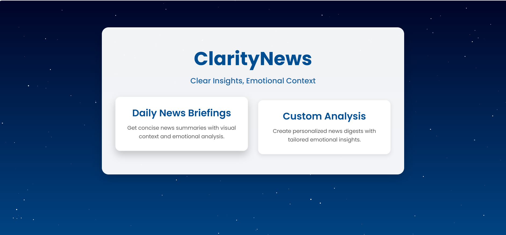

# Clarity News 📰  

Clarity News is an news aggregation system that scrapes daily articles from various news websites (currently one), providing concise insights through AI-powered summarization and sentiment analysis.  
#### Lil Video
https://drive.google.com/file/d/1u8D1rM7NAdZF9awh77EvOLgikmIB1shK/view



## 🔥 Features  

- **Automated News Scraping**: Extracts news articles from web news sources using `Selenium`.  
- **AI-Powered Summarization**: Uses `facebook/bart-large-cnn` for generating concise summaries of news articles.  
- **Sentiment Analysis**: Implements `facebook/bart-large-mnli` to classify news sentiment.  
- **Fine-Tuning Experiments**: Evaluates performance of fine-tuned `facebook/bart-base` and `unsloth/Meta-Llama-3.1-8B` on secondary datasets.  
- **Data Processing with PySpark**: Cleans and structures raw data for efficient processing.  
- **Visualization**: Uses `Matplotlib` and `Seaborn` to present sentiment insights effectively.  

## 🚀 Tech Stack  

- **Web App**: `Flask`   
- **Web Scraping**: `Selenium`  
- **AI Models**: `Transformers`, `Torch`  
- **Database**: `MySQL` (storing scraped news data)  
- **Data Processing**: `Pandas`, `PySpark`  
- **Visualization**: `Matplotlib`, `Seaborn`  

## 🛠 Installation  

### 1️⃣ Clone the Repository  
```sh
git clone https://github.com/your-username/Clarity-News.git
cd Clarity-News
```

### 2️⃣ Install Dependencies  
Ensure you have Python 3.8+ installed, then run:  
```sh
pip install -r requirements.txt
```

### 3️⃣ Set Up MySQL Database  
Create a MySQL database and update your `config.py` with the credentials:  
```python
DB_CONFIG = {
    "host": "localhost",
    "user": "your_user",
    "password": "your_password",
    "database": "news_db",
}

#  make your have done this
CREATE DATABASE IF NOT EXISTS news_db;
USE news_db;

-- Create 'news' table
CREATE TABLE IF NOT EXISTS news (
    id INT AUTO_INCREMENT PRIMARY KEY,
    title VARCHAR(255),
    link VARCHAR(255),
    content LONGTEXT
);

-- Create 'summaries' table
CREATE TABLE IF NOT EXISTS summaries (
    id INT AUTO_INCREMENT PRIMARY KEY,
    full_text TEXT,
    summary TEXT
);

```

### 4️⃣ Run the Application  
```sh
python main.py
```

## 🎯 Future Enhancements  

- Add support for multiple languages in summarization and sentiment analysis.  
- Improve model performance with additional fine-tuning on diverse datasets.  
- Develop a front-end dashboard for better user experience.  


---

⭐ **Star this repository** if you find it useful!  
=======

